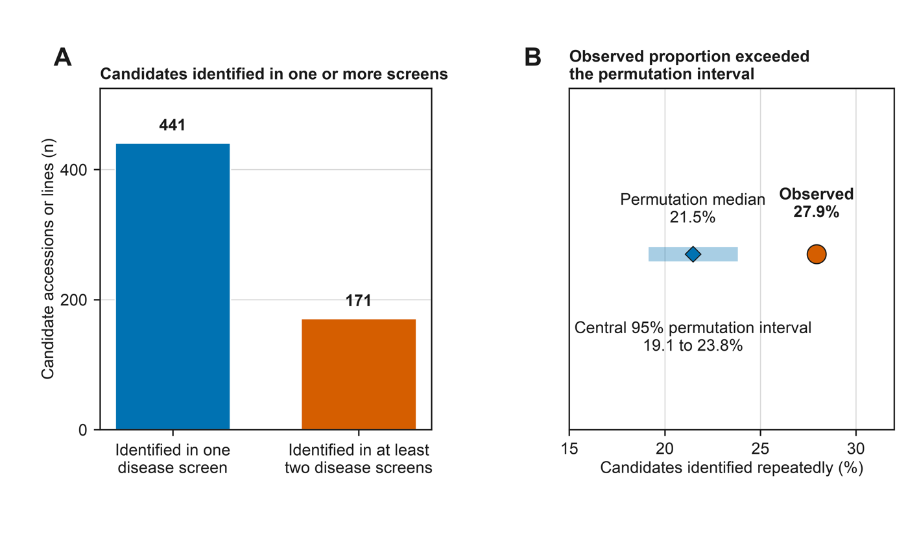

# Sorghum disease screen atlas

Code and supplementary files for *Repeated Identification of Candidate Germplasm Across Published Sorghum Disease Screens* (manuscript version 23).

## Start here

| If you are looking for… | Open… |
| --- | --- |
| The 171 candidates identified more than once | [Candidate registry](supplement/Recurrent_Candidate_Registry.csv) |
| The main calculations | [Analysis notebook](reproducibility/code/02_manuscript_analyses.ipynb) |
| Tables S1 to S17 | [Supplementary workbook](supplement/Supplementary_Tables_S1-S17.xlsx) |
| Figure source data | [Figure data](https://github.com/jimmmmmmmmmmmy/sorghum-disease-screen-atlas/tree/main/reproducibility/data/figure_source_data) |
| Individual rebuild commands | [Code guide](reproducibility/code/README.txt) |

## What we found

We compared results from 34 independent disease screens. Of 612 candidates that could be assessed in at least two screens, 171 were identified more than once. Seventy-eight were identified repeatedly for the same disease, while 93 were identified only across different diseases.

Five studies also tested the same germplasm against multiple diseases. Their observed multidisease count was 115, near the center of the exact distribution expected from the candidate totals in those studies.



## Run the analysis

The project uses Python 3.11. From a terminal:

```bash
git clone https://github.com/jimmmmmmmmmmmy/sorghum-disease-screen-atlas.git
cd sorghum-disease-screen-atlas

python3.11 -m venv ../sorghum-atlas-env
source ../sorghum-atlas-env/bin/activate
python -m pip install -r reproducibility/code/requirements.txt

python reproducibility/code/run_all.py \
  --package-root . \
  --output-dir ../sorghum-atlas-results
```

This reruns both notebooks and rebuilds the calculated result tables and candidate registries. To work through the notebooks interactively, run `jupyter lab reproducibility/code`.

The exact fixed-margin calculation is in the [analysis notebook](reproducibility/code/02_manuscript_analyses.ipynb). It uses a hypergeometric distribution for two-disease comparisons, conditional enumeration for three-disease comparisons, and discrete convolution to combine the five study distributions.

## Repository layout

```text
figures/                 Main manuscript figures
supplement/              Supplementary workbook, Figure S1, and candidate registry
reproducibility/code/    Notebooks and Python programs
reproducibility/data/    Prepared inputs, aggregate results, and figure data
```

## A note about the data

The repository includes the derived candidate classifications needed to reproduce the reported results. It does not include downloaded articles, third-party spreadsheets, or row-level phenotype measurements. Those materials remain with the original publications, repositories, or rights holders.

The source inventory records where each source was obtained and the terms that were available when it was reviewed. [Registry notes](supplement/Registry_Notes.txt) explain what is included in the candidate registry.
